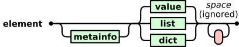
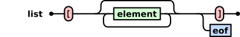
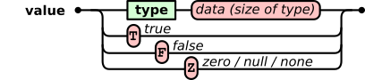
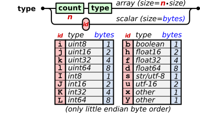
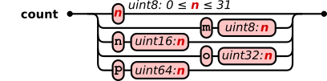

# Universal Binary Notation (UBN)

Universal Binary Notation file format specification (beta)

Introduction
------------
Universal Binary Notation (UBN) is a general purpose binary file format for hierarchically structured data. The basic syntax is very simple and easy to implement and it tries to satisfy the needs of all imaginable applications for binary data storage and exchange. The simplicity allows to generate typical data files by a few lines of code without any library. Simultaneously, with the use of meta information big data files can be generated that are manageable efficiently with random access.

The Vision
----------

The success of the Digital Revolution is based on the common notation of all kind of information by binary series of zeros and ones. It is therefore all the more astonishing that the idea of unification did not find it's way to the syntax of binary data structures. Many thousands binary file formats exist in the word that need custom-built programs or libraries to decode the data. The leak of a unified data structure format counteracts the full advantage of digitalization.

For text files universal formats exist, like [XML](https://www.w3.org/XML/), [JSON](http://www.json.org/), [CSV](https://en.wikipedia.org/wiki/Comma-separated_values). As a drawback text formats have limited speed and storage efficiency since numerical values have to be translated into its decimal text representations and included elements cannot be read without parsing the whole text file. 

Here comes the vision of a Universal Binary Notation (UBN) that is as easy to use and provides all desirable properties of binary formats. One single editor should be able to view and edit the content of any binary file format that is based on UBN. This would allow binary files to gain the popularity of text files that can all be opened by one text-editor. Due to it's binary structure sub-elements can be accessed directly and handled like files in directories of a file system.

But why a new format? Does no common binary formats exist for general purposes? There are some examples, however they suffer from too high complexity or limited versatility. Examples are HDF5 (Hierarchical Data Format) and UBJSON (Universal Binary Java Script Object Notation). The former is feature-rich and suitable for huge scientific data sets but has a quite complicated grammar while the latter is very simple, but is not optimized for big databases. UBN is supposed to bridging the gap.

Core Idea
---------

To unify the contradicting requirements of simplicity and advanced features, the format specification is divided into two meta levels. The basic grammar describes a very simple but hierarchical data structure. Advanced features such as random access are hidden in a special grammar rule for meta information. When ignoring the meta information, the file still can be parsed with the basic grammar and most of the binary data types can be decoded and interpreted. It is assumed that more than 90% of the UBN files will not make use of the additional meta information.

### Features of the grammar

1. Basic boolean, integer, floating point data types and strings
2. Arrays, multi-dimensional arrays
3. Lists of mixed arbitrary elements
4. Objects or dictionaries with key/value pairs for arbitrary elements
5. Arbitrary hierarchy levels
6. Files are syntactically valid even if not all elements are written yet

### Possible features by making use of the optional meta information

1. Table of contents
2. Fast random access to single elements even in big files
3. Structured types
4. Fast deletion and addition of elements in big files
5. Chunk data mode for efficient writing and reading of big files
6. Compression of data
7. Included checksum
8. Datetime definition


Status
------

UBN is under development. The grammar will be fixed at some point when it is consollidated that nothing important is missing. There will be no different versions for the grammar. At the moment a flag for a beta status is set. The meta language, in contrast, will grow from time to time and new features will be added. A version number will show it's status.

Grammar (beta1)
--------------

The graphical representation of the grammar rules below should enable a programmer to write valid UBN files. All red round boxes represent data to be written. Single black characters inside the round boxes are stored directly as ascii character. Green boxes represent nested grammer rules.














In comparison to text files for some binary elements no stop symbol can be defined since the whole value range is occupied for the binary data. Therefor the size of the data must be calculated and stored in front of the data. The size of the basic types are given in the type table. In case of arrays this value has to be multiplied accordingly.

Examples
--------

In the examples below symbols in brackets [ ] denote ascii characters that are stored directly in the binary data. Parenthesis ( ) shows the human readable representation of the corresponding binary data. All examples are valid and complete UBN files. No additional header is required. That's simple, isn't it?

* **String**:

```
"hello world"

UBN:
(uint8: 11) [s] [h] [e] [l] [l] [o] [ ] [w] [o] [r] [l] [d]
```

* **3d vector of type uint8:**

```
[10, 200, 255]

UBN:
(uint8: 3) [I] (uint8: 10) (uint8: 200) (uint8: 255)
```

* **3 x 3 matrix of double:**

```
[ [1.1, 3.3, 5.5],
  [2.2, 4.4, 6.6],
  [3.3, 5.5, 7.7] ]
  
UBN:  
(uint8: 3) (uint8: 3) [d] (float64: 1.1) (3.3)
(5.5) (2.2) (4.4) (6.6) (3.3) (5.5) (7.7)
```

* **800 x 600 x 3 RGB Image:**

```
UBN:
[N] (uint16: 800) [N] (uint16: 600) (uint8: 3) (... data ...)
```

* **Object:**

```
{
  "planet": "Proxima b",
  "mass": 1.27,
  "habitable": True
}

UBN:
[{] (6) [s] ("planet") (9) [s] ("Proxima b") (4) [s] ("mass")
[d] (float64: 1.27) (9) [s] ("habitable") [T] [}]
```

* **3 x 3 table of doubles with named colums "lon", "lat", "alt":**

```
[ ["lon", "lat", "alt"],
  [1.1,    3.3,    5.5],
  [2.2,    4.4,    6.6],
  [3.3,    5.5,    7.7],
  [4.4,    6.6,    8.8] ]

UBN:
[[] (int8: 3) (int8: 3) [s] [l] [o] [n] [l] [a] [t] [a] [l] [t]
(uint8: 3) [d] (1.1) (3.3) (5.5) (uint8: 3) [d] (2.2) (4.4)
(6.6) (uint8: 3) [d] (3.3) (5.5) (7.7) (uint8: 3) [d] (4.4)
(6.6) (8.8) []]
```

# Meta Language

Version: 0.1

The metainfo gives information about how to read or pre-process the data, before it is passed to the application. This is normally for optimizing the performance of large files. It can also contain application-specific information of how to apply the data. The metainfo consists of objects in front of elements and contains e.g. pointers to sub-elements, definitions of user-defined types for ```x``` or ```y```, or if matrices or vectors have to be transposed or concatenated when loaded to memory. The metainfo object contains pairs of keywords and values. Every keyword represents a feature that extents the UBN grammar. Two examples of meta information is given below. More will follow.

### Length of list or dict

**Keyword:** ```size```

**Value:** ```n```

**With:**

```
   n: unsigned integer
      Number of bytes of element
```

**Explanation:**

This meta information gives the number of bytes of an element. The size also includes the meta information itself, as well as white-space after the meta information. The size information helps to browse more quickly through the file structure in order to access a certain sub-element in large files.

**Example:**

Let's assume the element, including the meta information, is 1200 kByte. The meta information would be:

```
[<] (5) [s] [i] [z] [e]
    [N] (1200) [x]
[>]
```

### Structured types

**Keyword:** ```struct```

**Value:** ```{ (ax: v1): (ax: v2), ...}```

**With:**

```
   ax: array of type x or y
   
   v1: (array of type x or y definition)
       Bytes that match a type x or y array definition
       
   v2: (type) (type) ... 
       List of types that form the struct
```
**Explanation:**

The value of the meta info keyword ```struct``` is of type ```dict```. The dict contains one or multiple struct definitions. Each key of the dict is e.g. the ```x```-type with a certain length (```v1```) and the value of the dict contains the type definition of the struct (```v2```). A key could be for example ```v1 = (12) [x]```. This means that all arrays of type ```x``` that have the exact length of 12 will be interpreted as the struct defined by ```v2```. A struct definition that consist of an int32 and a float64 would be ```v2 = [k] [d]```.

In case many structs of the same size must be defined, ```v1``` also can contains some data to distinguish the different structs. The same data must then be present at the beginning of every data of the structured type.

The struct definition is also valid for nested elements, but can be overwritten temporarily inside the scope of the nested element.

**Example 1:**

Let's assume we want to define a struct int8 + float32. The metainfo would be

```
[<] (6) [s] [t] [r] [u] [c] [t]
    [{]
        (2) [x]
            (5) [x]
        (2) [x]
            [i] [f]
    [}]
[>]
```

An element of the struct with e.g. the numbers 120 and 2.25:

```
(2) [x] (int8: 123) (float32: 2.25)
```

When the interpreter finds a type that matches ```(2) [x]```, the bytes are interpreted as the defined struct.

**Example 2:**

Let's assume we want to define a struct int8 + float32 and another one int16 + int16 + int8, both of size 5 The metainfo would be

```
[<] (6) [s] [t] [r] [u] [c] [t]
    [{]
        (2) [x] (55)
            (5) [x]
        (2) [x]
            [i] [f]
        (2) [x] (77)
            (5) [x]
        (3) [x]
            [j] [j] [i]
    [}]
[>]
```
The values (55) and (77) are arbitrary bytes to distinguish the two structs. ```y``` instead of ```x``` could also be used to distinguish two structs of same length.

An element of struct 1 with the numbers 120 and 2.25 would be:

```
(3) [x] (55) (int8: 123) (float32: 2.25)
```

An element of struct 2 with the numbers 1234, 2345 and 7 would be:

```
(3) [x] (77) (int16: 1234) (int16: 2345) (int8: 7)
```
