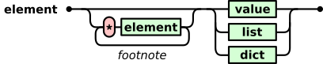
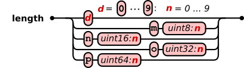

# Xeno (format)

Universal binary data language

Overview
--------

Xeno is a universal description language for binary data formats. It is the binary equivalent to [XML](https://www.w3.org/XML/) or [JSON](http://www.json.org/) without their limitations of efficiency.

The name Xeno derives from the ancient Greek word ξένος (_alien_), which well describes the property of a non-human-readable binary language.

Basic idea
----------

The grammar tries to be minimalistic while it covers all possible application cases. Missing features of the format can be added by so-called _footnotes_. As in books, footnotes can be ignored while reading, but provide additional background information about the context or meaning. A footnote adds user-defined meta data to an element, which allows the application to read or understand the data in a new specific way.

Properties
----------

### Features of the grammar

1. Basic boolean, integer, floating point data types and strings
2. Arrays, multi-dimensional arrays
3. Structured types, struct arrays
4. Lists of arbitrary elements with mixed types
5. Objects or dictionaries with key/value pairs for arbitrary elements
6. Unlimited hierarchy levels
7. More data can be appended to log files of valid and completed syntax
8. Elements start with printable ASCII characters and have a defined end, which makes it suitable for protocols of data streams.

### Possible format extensions by user-defined footnotes

1. Table of contents
2. Fast random access to certain sub-elements in big files
3. Fast deletion and addition of elements in big files
4. Chunk data mode for efficient writing and reading of big files
5. Checksums for integrity checks
6. Date and time notation formats
7. Notation of physical units
8. Values and arrays with complex numbers
9. Elements with data compression

Grammar
-------

The grammar is defined and explained by graphical figures. The red round boxes represent data to be written. Single black characters inside are stored directly as ASCII characters. Green boxes require nested grammer rules.

<p align="center"></p>

<p align="center"></p>

<p align="center"></p>

<p align="center"></p>

<p align="center"></p>

<p align="center"></p>

<p align="center"></p>

## Types

| Type   | Name      | Bytes | Description                    | Comment                                       |
|:------:|-----------|:-----:|--------------------------------|-----------------------------------------------|
| `i, m` | uint8     | 1     | unsigned integer 8-bit         | C-type: unsigned char                         |
| `j, n` | uint16    | 2     | unsigned integer 16-bit        | C-type: unsigned short int                    |
| `k, o` | uint32    | 4     | unsigned integer 32-bit        | C-type: unsigned int                          |
| `l, p` | uint64    | 8     | unsigned integer 64-bit        | C-type: unsigned long int                     |
| `I`    | int8      | 1     | signed integer 8-bit           | C-type: char                                  |
| `J`    | int16     | 2     | signed integer 16-bit          | C-type: short int                             |
| `K`    | int32     | 4     | signed integer 32-bit          | C-type: int                                   |
| `L`    | int64     | 8     | signed integer 64-bit          | C-type: long int                              |
| `b`    | boolean   | 1     | boolean type                   | values: 0x00 = false or 0xFF = true           |
| `h`    | float16   | 2     | half precision float 16-bit    | IEEE 754-2008 half precission                 |
| `f`    | float32   | 4     | float 32-bit                   | IEEE 754 single precision, C-type: float      |
| `d`    | float64   | 8     | double precision float 64-bit  | IEEE 754 double precision, C-type: double     |
| `s`    | str/utf-8 | 1     | ascii / utf-8 string           | no other coding than utf-8 is specified       |
| `u`    | utf-16    | 2     | unicode string in utf-16       |                                               |
| `e`    | element   | 1     | element as defined in grammar  | Encapsulated element in array of e            |
| `x`    | byte      | 1     | user defined data byte         | special structs, compressed data etc.         |

A special basic data type is `e` to enclose Xeno elements in an array of bytes. This acts as an additional size information for elements and helps to parse a file more quickly by stepping over large elements.

Examples
--------

In the examples below, characters in brackets `[ ]` symbolize characters that are directly stored as their ASCII values. Parentheses `( )` show readable representations of the corresponding binary data. If no type is noted for integers in parentheses the type is uint8. All examples are valid and complete Xeno files. No additional header is required. That's simple, isn't it?

* **String**:

```
"hello world"

Xeno:
     [m] (uint8: 11) [s] [h] [e] [l] [l] [o] [ ] [w] [o] [r] [l] [d]

hex: 6D          0B  73  68  65  6C  6C  6F  20  77  6F  72  6C  64
```

* **Integer:**

```
1025

Xeno:
[j] (uint16: 1025)

hex: 6A 01 04
```

* **3d vector of type uint8:**

```
[10, 200, 255]

Xeno:
       [3] [i] (uint8: 10) (uint8: 200) (uint8: 255)

hex:   33  69          0A           C8           FF   
```

* **List with integer, string and float:**

```
[7, "seven", 7.77]

Xeno:
[[] [i] (uint8: 7) (uint8: 5) [s] [seven] [d] (float64: 7.77) []]
```

* **Struct with integer, string and float:**

```
[(uint8) 7, (string*5) "seven", (double) 7.77]

Xeno:
[(] [i] [5] [s] [d] [)] (uint8: 7) [seven] (float64: 7.77)
```

* **3 x 3 matrix of double:**

```
[ [1.1, 3.3, 5.5],
  [2.2, 4.4, 6.6],
  [3.3, 5.5, 7.7] ]
  
Xeno:  
[3]
    [3] [d]
        (float64: 1.1) (3.3) (5.5)
        (2.2) (4.4) (6.6)
        (3.3) (5.5) (7.7)
```

* **800 x 600 x 3 RGB Image:**

```
Xeno:
[n] (uint16: 800)
    [n] (uint16: 600)
        [3] [i]
        (... 800*600*3 bytes of data ...)
```

* **Object:**

```
{
  "planet": "Proxima b",
  "mass": 1.27,
  "habitable": True
}

Xeno:
[{]
    [6] [s] [planet] [9] [s] [Proxima b]
    [4] [s] [mass] [d] (float64: 1.27)
    [9] [s] [habitable] [T]
[}]
```

* **4 x 3 table of doubles with named colums "lon", "lat", "h":**

```
[ ["lon", "lat",   "h"],
  [1.1,    3.3,    5.5],
  [2.2,    4.4,    6.6],
  [3.3,    5.5,    7.7],
  [4.4,    6.6,    8.8] ]

Xeno:
[[]
    [[]
        [3] [s] [lon]
        [3] [s] [lat]
        [s] [h]
    []]
    [4] [3] [d]
        (1.1) (3.3) (5.5)
        (2.2) (4.4) (6.6)
        (3.3) (5.5) (7.7)
        (4.4) (6.6) (8.8)
[]]
```

# Footnotes
## Overview

The content of the `footnote` element gives information and hints about how to read, interpret or pre-process the data, before it is used by the application. The footnote can be a list, dict or any other data type. A parser that makes no use of the footnotes must parse the element after `[*]`, to find out its size, but can ignore its content.

Information about jump positions in table of contents are given, as a convention, relative to the `*` character of the footnote. This position has to be remembered by the parser as the reference position.

Footnotes with several information items can be organized in lists or dicts, or footnotes can be nested as in the example:
```
[*] (footnote with unit) [*] (footnote with table of content) (data of type list)
```
Footnote elements can have a string identifier keyword to indicate the purpose of the footnote or to identify a use-case specific meta language. The string identifiers are a footnote to the footnote, e.g.:

```
[*] [*] (string with meta language identifier) [{] (dict with meta information) [}] (data element)
```

## Default Footnote Meta Language Elements

Version: 0.2

### Deleted element

**Purpose:** Flags an element as deleted

**Optional identifier keyword:** `deleted`

**Footnote type:** None

**Footnote value:** `N` (None)

**Explanation:**

This footnote tags an element as deleted. This is useful for big files when an element in the middle should be deleted without rewriting the whole file. To adapt the size, the data of the deleted element can be an array of `x` to cover the rest of the element. Next time the entire file is rebuilt, the unused space can be eliminated.

**Example:**

In the following example an element with 10000 bytes is tagged as deleted. The included footnote and the `x` byte-array type definition together are 6 bytes long. The remaining bytes of the 10000 bytes are covered by the 9994 long `x` array. So, only 6 bytes have to be changed to remove the whole element.

```
[*] [N]
[n] (uint16: 9994) [x] (data with 9994 byte)
```

### Element visibility

**Purpose:** Flags an element as visible or invisible (disabled)

**Optional identifier keyword:** `enabled`

**Footnote type:** boolean `T` or `F`

**Footnote value:** `T` (true for enabled), `F` (false for disabled or deleted)

**Explanation:**

This footnote type tags an element as invisible, when the value is set to false. This feature can be used as placeholder for e.g. elements to be added later or flexible ordered elements for other elements pointing on it with links.

**Example:**

In the following example an element is tagged as invisible. This element is treated as non-exisiting, but the element will not be deleted when the file is rebuilt, since the content is used for a certain purpose.

```
[*] [F] (some element)
```

## Table of content for quick random access

**Purpose:** Table of content: List with the relative starting positions of all elements in a list or dict data

**Optional identifier keyword:** `TOC`

**Footnote type:** array of unsigned integer (`i`,`j`,`k`,`l`)

**Footnote value:** relative byte offset to the list elements from the beginning of the footnote

**Explanation:**

This footnote type allows to access elements of lists or dicts in large data files. The relative offsets are stored in an integer array with the same length as the list or dict object. The offset points to the beginning of each element (in list) or the keyword value (in dict). If the targeting element has another footnote, the offset points to the `*` token which is the first byte of the list element.

**Example:**

This example shows short list with mixed types and a table of content with offsets

```
[7, "seven", 7.77]

Xeno:

[*] [3] [i]                # uint8 array of length 3
        (7) (9) (16)       # offsets to the elements
[[] [i] (uint8: 7) (uint8: 5) [s] [seven] [f] (float32: 7.77) []]
     ^              ^                      ^   # target positions 
```

## Element links

**Purpose:** In more complex data structures and big files it can be usefull to use links to elements. This allows to quickly parse the main structure without reading the whole data and to allows to add, move or delete elements.

**Footnote type:** String

**Footnote value:** `@`

**Element value:** The content of the element is replaced by an unsigned integer (`i`,`j`,`k`,`l`) or array of unsigned integers that points to the absolute address (relative to the beginning of the file) of the elements with the actual data.

**Explanation:**

This footnote type allows to keep the main data structure small and efficient and allows fast random access to sub elements and more flexibility. The elements of the structure contain only the links to the actuall elements which are stored in a list at then end.

**Example:**

In this example imagine that a data structure contains some very big elements:

```
{
  'file1': 'bigdata1',
  'folder1': {'fileA': 'bigdata2', 'fileB': 'bigdata3'}
}

Xeno:

[[]  # List
    # Data Structure with links instead of actual data elements
    [{]
        [5] [s] [file1]
            [*] [s] [@] [i] (...)  # Link to element bigdata1
        [{] 
            [5] [s] [fileA]
                [*] [s] [@] [i] (...)  # Link to element bigdata2
            [5] [s] [fileB]
                [*] [s] [@] [i] (...)  # Link to element bigdata3
        [}]
        [*] [F] [n] (1000) [x] (1000 Byte) # Invisible place holder buffer for
    [}]                                    # adding more elements in future
    [8] [s] [bigdata1]
    [8] [s] [bigdata2]
    [8] [s] [bigdata3]

# No []] at the end to append more elements in future

```
