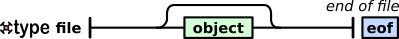
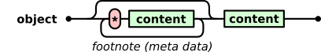

# xtype (format) 

A universal binary notation language

Overview
--------

xtype is a universal binary notation language for the exchange and storage of hierarchically structured data. It is supposed to be a binary equivalent to text formats like [XML](https://www.w3.org/XML/) or [JSON](http://www.json.org/) without their limitations of efficiency. xtype is also suitable for the representation of typical C and Python data structures and offers a lightweight grammar alternative to [HDF5](https://www.hdfgroup.org/solutions/hdf5/) for scientific data storage, inspired by the simplicity of [UBJSON](https://github.com/ubjson/universal-binary-json).

For the time being there exists neither an xtype programming library nor an xtype editor or reader.

Basic idea
----------

The grammar tries to be minimalistic while covering all possible use cases. Missing features of the format can be supplemented by so-called _footnotes_. Similar to books, footnotes can be ignored when reading if the meaning of the content is known, but provide additional background information about the meaning or context. A footnote adds user-defined metadata to the element that allows the application to read or understand the data in a specific way.

Properties
----------

### Features of the grammar

* Basic boolean, integer, floating point data types and strings
* Arrays, multi-dimensional arrays
* Structured types, struct arrays
* Lists of arbitrary elements with mixed types
* Objects or dictionaries with key/value pairs for arbitrary elements
* Unlimited hierarchy levels
* Open lists allow to append elements sequentially to a log file while the syntax is valid and complete after every update.
* All elements start with printable ASCII characters and have a defined end, which makes it suitable for protocols of data streams.

### Possible format extensions by user-defined footnotes (meta information)

* Table of contents
* Fast random access to certain sub-elements in big files
* Fast deletion and addition of elements in big files
* Chunk data mode for efficient writing and reading of big files
* Checksums for integrity checks
* Date and time notation formats
* Notation of physical units
* Values and arrays with complex numbers
* Elements with data compression

Grammar
-------

The grammar is fully defined and explained by a graphical representation. Green boxes require nested grammar rules. Red round boxes represent data to be written. Single non-italic black characters in these red boxes are stored directly as ASCII characters. Red symbols in the red boxes are placeholders for certain other ASCII characters, as shown.

<p align="center"></p>
<p align="center"></p>
<p align="center"></p>
<p align="center"></p>
<p align="center"></p>
<p align="center"></p>
<p align="center"></p>

### Grammar rules

    <file> ::= <EOF>
    <file> ::= <object> <EOF>
    <object> ::= <content>
    <object> ::= <footnote> <content>
    <footnote> ::= "*" <object>
    <footnote> ::= "*" <object> <footnote>
    <content> ::= <element> | <list> | <dict>
    <list> ::= "[]" | "[" <EOF>
    <list> ::= "[" <list_items> "]" | "[" <list_items> <EOF>
    <list_items> ::= <object> | <object> <list_items>
    <dict> ::= "{}"
    <dict> ::= "{" <dict_elem> "}"
    <dict_items> ::= <element> <object> | <element> <object> <dict_items>
    <element> ::= <type> <data>
    <type> ::= <lenght> <type> | "(" <types> ")" | <scalar>
    <types> ::= <type> | <type> <types>
    <bin_type> ::= "i" | "j" | "k" | "l" | "I" | "J" | "K" | "L"
    <bin_type> ::= "b" | "h" | "f" | "d" | "s" | "u" | "O" | "x"
    <lenght> ::= "0" | "1" | "2" | "3" | "4"
    <lenght> ::= "5" | "6" | "7" | "8" | "9"
    <lenght> ::= "m" <bin_data> | "n" <bin_data>
    <lenght> ::= "o" <bin_data> | "p" <bin_data>
    <scalar> ::= <bin_type> <bin_data>
    <bin_data> ::= (binary data of defined length)

## Types

| Type   | Name      | Bytes | Description                    | Comment                                       |
|:------:|-----------|:-----:|--------------------------------|-----------------------------------------------|
| `i, m` | uint8     | 1     | unsigned integer 8-bit         | C-type: unsigned char                         |
| `j, n` | uint16    | 2     | unsigned integer 16-bit        | C-type: unsigned short int                    |
| `k, o` | uint32    | 4     | unsigned integer 32-bit        | C-type: unsigned int                          |
| `l, p` | uint64    | 8     | unsigned integer 64-bit        | C-type: unsigned long int                     |
| `I`    | int8      | 1     | signed integer 8-bit           | C-type: char                                  |
| `J`    | int16     | 2     | signed integer 16-bit          | C-type: short int                             |
| `K`    | int32     | 4     | signed integer 32-bit          | C-type: int                                   |
| `L`    | int64     | 8     | signed integer 64-bit          | C-type: long int                              |
| `b`    | boolean   | 1     | boolean type                   | values: 0x00 = false or 0xFF = true           |
| `h`    | float16   | 2     | half precision float 16-bit    | IEEE 754-2008 half precission                 |
| `f`    | float32   | 4     | float 32-bit                   | IEEE 754 single precision, C-type: float      |
| `d`    | float64   | 8     | double precision float 64-bit  | IEEE 754 double precision, C-type: double     |
| `s`    | str/utf-8 | 1     | ascii / utf-8 string           | Only utf-8 is specified for 1-byte text coding|
| `u`    | utf-16    | 2     | unicode string in utf-16       | 2-byte text coding                            |
| `O`    | object    | 1     | object as defined in grammar   | For elements encapsulated in a byte array     |
| `x`    | byte      | 1     | user defined data byte         | Special structs, compressed data etc.         |

The special basic data type `O` is used to enclose xtype objects in an array of bytes. This acts as an additional size information for objects and helps to parse a file more quickly by stepping over large objects.

Examples
--------

In the examples below, characters in brackets `[ ]` symbolize characters that are directly stored as their ASCII values. Parentheses `( )` show readable representations of the corresponding binary data. All examples are valid and complete xtype files. No additional header is required. That's simple, isn't it?

* **String**:

```json5
"hello world"
```
```Awk
xtype: [m] (uint8: 11) [s] [h] [e] [l] [l] [o] [ ] [w] [o] [r] [l] [d]
hex:   6D          0B  73  68  65  6C  6C  6F  20  77  6F  72  6C  64
```

In this string example the first 3 bytes represent the header: the size type (m), the size (11 as 8-bit integer) and the array type (s for string). The next 11 bytes contain the text.

* **Integer:**

```json5
1025
```
```Awk
xtype:
      [j] (uint16: 1025)
hex:  6A 01 04
```

* **3d vector of type uint8:**

```json5
json:
[10, 200, 255]
```
```Awk
xtype:
       [3] [i] (uint8: 10) (uint8: 200) (uint8: 255)
hex:   33  69          0A           C8           FF
```

* **List with integer, string and float:**

```json5
json:
[7, "seven", 7.77]
```
```Awk
xtype:
[[] [i] (uint8: 7) (uint8: 5) [s] [seven] [d] (float64: 7.77) []]
```

* **Struct with integer, string and float:**

```json5
json:
[(uint8) 7, (string*5) "seven", (double) 7.77]
```
```Awk
xtype:
[(] [i] [5] [s] [d] [)] (uint8: 7) [seven] (float64: 7.77)
```

* **3 x 3 matrix of double:**

```json5
json:
[ [1.1, 3.3, 5.5],
  [2.2, 4.4, 6.6],
  [3.3, 5.5, 7.7] ]
```
```Awk
xtype:
[3]
    [3] [d]
        (float64: 1.1) (3.3) (5.5)
        (2.2) (4.4) (6.6)
        (3.3) (5.5) (7.7)
```

* **800 x 600 x 3 RGB Image:**

```Awk
xtype:
[n] (uint16: 800)
    [n] (uint16: 600)
        [3] [i]
        (... 800*600*3 bytes of data ...)
```

* **Object:**

```json5
json:
{
  "planet": "Proxima b",
  "mass": 1.27,
  "habitable": True
}
```
```Awk
xtype:
[{]
    [6] [s] [planet] [9] [s] [Proxima b]
    [4] [s] [mass] [d] (float64: 1.27)
    [9] [s] [habitable] [T]
[}]
```

* **4 x 3 table of doubles with named colums "lon", "lat", "h":**

```json5
json:
[ ["lon", "lat",   "h"],
  [1.1,    3.3,    5.5],
  [2.2,    4.4,    6.6],
  [3.3,    5.5,    7.7],
  [4.4,    6.6,    8.8] ]
```
```Awk
xtype:
[[]
    [[]
        [3] [s] [lon]
        [3] [s] [lat]
        [s] [h]
    []]
    [4] [3] [d]
        (1.1) (3.3) (5.5)
        (2.2) (4.4) (6.6)
        (3.3) (5.5) (7.7)
        (4.4) (6.6) (8.8)
[]]
```

# Footnotes
## Overview

The content of the `footnote` element gives information and hints about how to read, interpret or pre-process the data, before it is used by the application. The footnote can be a list, dict or any other data type. A parser that makes no use of the footnotes must parse the element after `[*]`, to determine its size, but can ignore its content.

Information about jump positions in table of contents are given, as a convention, relative to the `*` character of the footnote. This position has to be remembered by the parser as the reference position.

Footnotes with several information items can be organized in lists or dicts, or multiple footnotes can be concatenated, as for example:
```Awk
[*] (footnote with unit) [*] (footnote with table of content) (data of type list)
```

## Default Footnote Meta Language Elements

### File signature

_Footnote Purpose_ | File signature and byte order mark
:---|:---
_Footnote type_ | 16-bit signed integer (`J`)
_Footnote value_ | 1234

**Explanation:**

This is a footnote at the very beginning of the file to indicate the byte order (little or big endian) and acts as the file signature with four magic bytes. The 16-bit signed integer has the defined value of 1234. An xtype reader with the wrong byte order would recognize the number as -11772. If no such file signature is given, xtype is specified for little endian byte order.

```Awk
xtype: [*] [J] (1234)
hex:  2A  4A  D2 04    # little endian (default)
hex:  2A  4A  04 D2    # big endian
```

**Example:**

```Awk
xtype file:
[*] [J] (1234) (data of the file)
```

### Deleted object

_Footnote Purpose_ | Flags an object as deleted
:---|:---
_Footnote type_ | None
_Footnote value_ | `N` (_None_)

**Explanation:**

This footnote tags an object as deleted. This is useful for big files when an object in the middle should be deleted without rewriting the whole file. To adapt the size, the data of the deleted object can be an array of `x` to cover the rest of the object. Next time the entire file is rebuilt, the unused space can be eliminated.

**Example:**

In the following example an object with 10000 bytes is tagged as deleted. The included footnote and the `x` byte-array type definition together are 6 bytes long. The remaining bytes of the 10000 bytes are covered by the 9994 long `x` array. So, only 6 bytes have to be changed to remove the whole object.

```Awk
[*] [N]
[n] (uint16: 9994) [x] (data with 9994 byte)
```

### Element visibility

_Footnote Purpose_ | Flags an object as visible or invisible / disabled
:---|:---
_Footnote type_ | boolean `T` or `F`
_Footnote value_ | `T` (true for visible / enabled), `F` (false for invisible / disabled)


**Explanation:**

This footnote type tags an object as invisible, when the value is set to false. This feature can be used as placeholder for e.g. objects to be added later or flexible ordered objects for other objects pointing on it with links.

**Example:**

In the following example an object is tagged as invisible. This object is treated as non-exisiting, but the object will not be deleted when the file is rebuilt, since the content is used for a certain purpose.

```Awk
[*] [F] (some object)
```

## Table of content for quick random access

_Footnote Purpose_ | Table of content: pointer to objects in a list or dict
:---|:---
_Footnote type_ | array of unsigned integer (`i`,`j`,`k`,`l`)
_Footnote value_ | relative byte offset to the list objects from the the footnote start `*`
_Optional keyword_ |  `TOC`

**Explanation:**

This footnote type allows to access objects of lists or dicts in large data files. The relative offsets are stored in an integer array with the same length as the list or dict object. The offset points to the beginning of each object (in list) or the keyword value (in dict). If the targeting object has another footnote, the offset points to the `*` token which is the first byte of the list object.

**Example:**

This example shows short list with mixed types and a table of content with offsets

```json5
json:
[7, "seven", 7.77]
```
```Awk
xtype:
[*] [3] [i]                # uint8 array of length 3
        (7) (9) (16)       # offsets to the objects
[[] [i] (uint8: 7) (uint8: 5) [s] [seven] [f] (float32: 7.77) []]
     ^              ^                      ^   # target positions
```

## Object links

_Footnote Purpose_ | Pointers to objects instead of the data itself
:---|:---
_Footnote type_ | String (`s`)
_Footnote value_ | `@`
_Object value_ | Unsigned integer (`i`,`j`,`k`,`l`) with absolute address of actual object

**Explanation:**

The content of the object is replaced by an unsigned integer (`i`,`j`,`k`,`l`) or array of unsigned integers pointing to the absolute address (relative to the beginning of the file) of the objects with the actual data. This footnote type allows to keep the main data structure small and efficient and allows fast random access to sub objects which gives also more flexibility to manage the content.

**Example:**

In this example imagine that a data structure contains some very big objects:

```json5
json:
{
  "file1": "bigdata1",
  "folder1": {"fileA": "bigdata2", "fileB": "bigdata3"}
}
```

```Awk
xtype:
[[]  # List
    # Data Structure with links instead of actual data objects
    [{]
        [5] [s] [file1]
            [*] [s] [@] [i] (...)  # Link to object bigdata1
        [{]
            [5] [s] [fileA]
                [*] [s] [@] [i] (...)  # Link to object bigdata2
            [5] [s] [fileB]
                [*] [s] [@] [i] (...)  # Link to object bigdata3
        [}]
        [*] [F] [n] (1000) [x] (1000 Byte) # Invisible place holder buffer for
    [}]                                    # adding more objects in future
    [8] [s] [bigdata1]   # Link target with actual data
    [8] [s] [bigdata2]   # Link target with actual data
    [8] [s] [bigdata3]   # Link target with actual data

# No []] at the end. This allows to append more objects later.

```
