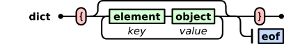
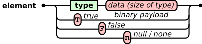
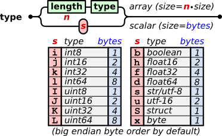

# xtype (format) 

A universal binary format for data exchange

Overview
--------

xtype is a universal binary notation language with a self-explanatory syntax for the exchange and storage of hierarchically structured data. It is intended to be a binary equivalent to text formats such as [XML](https://www.w3.org/XML/) or [JSON](http://www.json.org/) without their limitations in efficiency. xtype is also suitable for representing typical C and Python data structures, and provides a lightweight grammar alternative to [HDF5](https://www.hdfgroup.org/solutions/hdf5/) for scientific data storage, inspired by the simplicity of [UBJSON](https://github.com/ubjson/universal-binary-json).

The first test library for reading and writing Python structures is available at [xtype-python](https://github.com/bitagoras/xtype-python).

Basic idea
----------

The grammar tries to be minimalistic while covering all possible use cases. Missing features of the format can be supplemented by so-called _footnotes_. Similar to books, footnotes can be ignored when reading if the meaning of the content is known, but provide additional background information about the meaning or context. A footnote adds user-defined metadata to the element, allowing the application to read or understand the data in a particular way.

AI generated [audio introduction to xtype (notebookLM)](https://notebooklm.google.com/notebook/462113f1-ea9b-4f1b-bbe0-cae4828c5c13/audio)

Properties
----------

### Features of the grammar

* Basic boolean, integer, floating point data types, strings and structs
* Arrays, multi-dimensional arrays
* Lists of arbitrary elements with mixed types
* Objects or dictionaries with key/value pairs for arbitrary elements
* Unlimited hierarchy levels
* Open lists allow to append elements sequentially to a log file while the syntax is valid and complete after every update.
* All elements start with printable ASCII characters and have a defined end, which makes it suitable for protocols of data streams.
* The data elements can be parsed very fast without a stack.

### Additional (possible) features by user-defined "footnotes" (meta information)

* Definition of structs
* Table of contents
* Fast random access to sub-elements in big files
* Fast deletion and addition of elements in big files
* Chunk data mode for efficient writing and reading of big files
* Checksums for integrity checks
* Date and time notation formats
* Notation of physical units
* Values and arrays with complex numbers
* Elements with data compression

Grammar
-------

The grammar is fully defined and explained by a graphical representation. Green boxes require nested grammar rules. Red round boxes represent data to be written. Single non-italic black characters in these red boxes are stored directly as ASCII characters. Red symbols in the red boxes are placeholders for certain other ASCII characters, as shown.

### Grammar rules as figures

<p align="center"></p>
<p align="center"></p>
<p align="center"></p>
<p align="center"></p>
<p align="center"></p>
<p align="center"></p>
<p align="center"></p>
<p align="center"></p>

### Grammar rules as text (Backus-Naur form)

```xml
<file>       ::= <EOF> | <object> <EOF>
<object>     ::= <content> | <footnote> <content>
<footnote>   ::= "*" <content> | "*" <content> <footnote>
<content>    ::= <element> | <list> | <dict>
<list>       ::= "[]" | "[" <list_items> "]" | "[" <EOF> | "[" <list_items> <EOF>
<list_items> ::= <object> | <object> <list_items>
<dict>       ::= "{}" | "{" <dict_items> "}" | "{" <EOF> | "{" <list_items> <EOF>
<dict_items> ::= <element> <object> | <element> <object> <dict_items>
<element>    ::= <type> <bin_data> | "T"  | "F" | "n"
<type>       ::= <lenght> <type> | <bin_data>
<lenght>     ::= "0" | "1" | "2" | "3" | "4" | "5" | "6" | "7" | "8" | "9" |
                 "M" <bin_data> | "N" <bin_data> | "O" <bin_data> | "P" <bin_data>
<bin_type>   ::= "i" | "j" | "k" | "l" | "I" | "J" | "K" | "L" |
                 "b" | "h" | "f" | "d" | "s" | "u" | "S" | "x"

<bin_data> is the binary data of defined size, see table with types below.
<EOF> is the end of file. In streams this could also be defined by a zero byte.
```

## Types

| Type     | Name      | Bytes | Description                    | Comment                                       |
|:--------:|-----------|:-----:|--------------------------------|-----------------------------------------------|
| `i`      | int8      | 1     | signed integer 8-bit           | C-type: char                                  |
| `j`      | int16     | 2     | signed integer 16-bit          | C-type: short int                             |
| `k`      | int32     | 4     | signed integer 32-bit          | C-type: int                                   |
| `l`      | int64     | 8     | signed integer 64-bit          | C-type: long int                              |
| `I`, `M` | uint8     | 1     | unsigned integer 8-bit         | C-type: unsigned char                         |
| `J`, `N` | uint16    | 2     | unsigned integer 16-bit        | C-type: unsigned short int                    |
| `K`, `O` | uint32    | 4     | unsigned integer 32-bit        | C-type: unsigned int                          |
| `L`, `P` | uint64    | 8     | unsigned integer 64-bit        | C-type: unsigned long int                     |
| `b`      | boolean   | 1     | boolean type                   | values: false = 0x00, true = 0x01 (or 0xFF)   |
| `h`      | float16   | 2     | half precision float 16-bit    | IEEE 754-2008 half precission                 |
| `f`      | float32   | 4     | float 32-bit                   | IEEE 754 single precision, C-type: float      |
| `d`      | float64   | 8     | double precision float 64-bit  | IEEE 754 double precision, C-type: double     |
| `s`      | str/utf-8 | 1     | ascii / utf-8 string           | Only utf-8 is specified for 1-byte text coding|
| `u`      | utf-16    | 2     | unicode string in utf-16       | 2-byte text coding                            |
| `S`      | struct    | 1     | Struct type (size of array)    | Definition of the struct is given as footnote |
| `x`      | byte      | 1     | user defined data byte         | Special data formats, compressed data etc.    |

The characters `M`, `N`, `O`, `P` indicate the same types as `I`, `J`, `K`, `L` (uint8 to uint64) but describe array lengths instead of data content. In arrays of the string types `s` and `u` the last dimension is expected to define the length of the string rather than an array of single characters. The struct type `S` expects an array of at least one dimension where the last dimension defines the number of bytes in the struct.

Examples
--------

In the examples below, characters in brackets `[ ]` symbolise characters that are stored directly as their ASCII values. Parentheses `( )` show readable representations of the corresponding binary data. All the examples are valid and complete xtype files and no additional header is required.

* **String**:

```json5
"hello world"
```

```Awk
xtype: [M] (uint8: 11) [s] [h] [e] [l] [l] [o] [ ] [w] [o] [r] [l] [d]
hex:   6D          0B  73  68  65  6C  6C  6F  20  77  6F  72  6C  64
```

In this string example the first 3 bytes represent the header of the object: the size type (M), the size (11 as 8-bit integer) and the array type (s for string). The next 11 bytes contain the text.

* **Integer:**

```json5
1025
```

```Awk
xtype:
      [J] (uint16: 1025)
hex:  6A 04 01
```

* **3d vector of type uint8:**

```json5
json:
[10, 200, 255]
```

```Awk
xtype:
       [3] [I] (uint8: 10) (uint8: 200) (uint8: 255)
hex:   33  49          0A           C8           FF
```

* **List with integer, string and float:**

```json5
json:
[7, "seven", 7.77]
```

```Awk
xtype:
[[] [k] (int32: 7) [5] [s] [seven] [d] (float64: 7.77) []]
```

* **Struct with integer, string and float:**

```json5
json:
[7, "seven", 7.77]
```

```Awk
xtype:
[(] [k] [5] [s] [d] [)] (int32: 7) [seven] (float64: 7.77)
```

* **3 x 3 matrix of double:**

```json5
json:
[ [1.1, 3.3, 5.5],
  [2.2, 4.4, 6.6],
  [3.3, 5.5, 7.7] ]
```

```Awk
xtype:
[3]
    [3] [d]
        (float64: 1.1) (3.3) (5.5)
        (2.2) (4.4) (6.6)
        (3.3) (5.5) (7.7)
```

* **800 x 600 x 3 RGB Image:**

```Awk
xtype:
[N] (uint16: 800)
    [N] (uint16: 600)
        [3] [I]
        (... 800*600*3 bytes of data ...)
```

* **Object:**

```json5
json:
{
  "planet": "Proxima b",
  "mass": 1.27,
  "habitable": True
}
```

```Awk
xtype:
[{]
    [6] [s] [planet] [9] [s] [Proxima b]
    [4] [s] [mass] [d] (float64: 1.27)
    [9] [s] [habitable] [T]
[}]
```

* **4 x 3 table of doubles with named colums "lon", "lat", "h":**

```json5
json:
[ ["lon", "lat",   "h"],
  [1.1,    3.3,    5.5],
  [2.2,    4.4,    6.6],
  [3.3,    5.5,    7.7],
  [4.4,    6.6,    8.8] ]
```

```Awk
xtype:
[[]
    [[]
        [3] [s] [lon]
        [3] [s] [lat]
        [s] [h]
    []]
    [4] [3] [d]
        (1.1) (3.3) (5.5)
        (2.2) (4.4) (6.6)
        (3.3) (5.5) (7.7)
        (4.4) (6.6) (8.8)
[]]
```

# Footnotes

## Overview

The content of the `footnote` object gives information and hints about how to read, interpret or pre-process the data, before it is used by the application. The footnote can be a list, dict or any other data type. A parser that makes no use of the footnotes must parse the object after `[*]`, to determine its size, but can ignore its content to only read the data.

Information about jump positions in table of contents are given, as a convention, relative to the `*` character (TBC) of the footnote. This position has to be remembered by the parser as the reference position.

Footnotes with several information items can be organized in lists or dicts, or multiple footnotes can be concatenated, as for example:

```Awk
[*] (footnote with unit) [*] (footnote with table of content) (data of type list)
```

## Default Footnote Meta Language Elements

### File signature and byte order mark

_Footnote Purpose_ | File signature and byte order mark
:---|:---
_Footnote type_ | 16-bit signed integer (`j`)
_Footnote value_ | 1234

**Explanation:**

This is a footnote at the very beginning of the file can be used to indicate the byte order (big or little endian) and can also act as the file signature with two or four magic bytes. The 16-bit signed integer has the defined value of 1234. An xtype reader with the wrong byte order would read the number as -11772. If no such file signature is given, xtype is specified for big endian byte order as default.

```Awk
xtype: [*] [j] (1234)
hex:  2A  4A  04 D2    # big endian (default)
hex:  2A  4A  D2 04    # little endian
```

**Example:**

```Awk
xtype file:
[*] [j] (1234) (data of the file)
```

### Size information

_Footnote Purpose_ | Size information of object
:---|:---
_Footnote type_ | any unsigned integer (`I`, `J`, `K`, `L`)
_Footnote value_ | size of entire object

**Explanation:**

This footnote type gives the information about the size of an object. This can be used to step over large objects in a list or dict to quickly access a certain sub element. The size excludes this and all previous footnotes. When the size information is used to skip this object, the size gives the number of bytes to be irgnored.

**Example:**

```Awk
xtype file:
[*] [J] [[]
```

### Deleted object

_Footnote Purpose_ | Flags an object as deleted
:---|:---
_Footnote type_ | None
_Footnote value_ | `N` (_None_)

**Explanation:**

This footnote tags an object as deleted. This is useful for big files when an object in the middle should be deleted without rewriting the whole file. To adapt the size, the data of the deleted object can be an array of `x` to cover the rest of the object. Next time the entire file is rebuilt, the unused space can be eliminated.

**Example:**

In the following example an object with 10000 bytes is tagged as deleted. The included footnote and the `x` byte-array type definition together are 6 bytes long. The remaining bytes of the 10000 bytes are covered by the 9994 long `x` array. So, only 6 bytes have to be written to remove the whole object without the need of moving data after the element or updating any relativ pointers.

```Awk
[*] [n]
[N] (uint16: 9994) [x] (data with 9994 byte)
```

### Element visibility

_Footnote Purpose_ | Flags an object as visible or invisible / disabled
:---|:---
_Footnote type_ | boolean `T` or `F`
_Footnote value_ | `T` (true for visible / enabled), `F` (false for invisible / disabled)

**Explanation:**

This footnote type tags an object as invisible, when the value is set to false. This feature can be used as placeholder for e.g. objects to be added later or flexible ordered objects for other objects pointing on it with links.

**Example:**

In the following example an object is tagged as invisible. This object is treated as non-exisiting, but the object will not be deleted when the file is rebuilt, since the content is used for a certain purpose.

```Awk
[*] [F] (some object)
```

## Struct

_Footnote Purpose_ | Struct definition
:---|:---
_Footnote type_ | Struct (array of type "S")
_Footnote value_ | Sequence that contains a xtype list or dict as a prototype of the struct without any data payload in the elements.
_Target element_ | Struct (array of type "S") or array of struct that is defined by the footnote element.

**Explanation:**

The struct description is a xtype list or xtype dict inside the footnote type "S" array data. The elements of this list or dict have no data payload and consist only of the type identifiers or array lengths. When a dict is used for the struct description, the names of each field can be given.

**Example:**

The struct shall be the following C-structure:

```C
typedef struct {
    short count;
    char id[3]; // 3-byte char array
    float average;
} myStruct;
```

The xtype type symbols are k, 3s, d. The byte sequence of the struct prototype is `[j3sf]`. In a named struct definition the sequence would be `{5scountj2sid3s7saveragef}`, which is in a more readable form `{`(`5s`)"`count`": `j`, (`2s`)"`id`": `3s`, (`7s`)"`average`" :`f}`.


```Awk
xtype:
[*] [6] [S]                         # Footnote with length of struct definition
        [[] [j] [3] [s] [f] []]     # struct definition (size 2+3+4 = 9)
[5] [9] [S] (data with size 5 x 9)  # array of 5 times this 9-byte struct type
```

## Table of content for quick random access

_Footnote Purpose_ | Table of content: pointer to objects in a list or dict
:---|:---
_Footnote type_ | array of unsigned integer (`I`,`J`,`K`,`L`)
_Footnote value_ | relative byte offset to the list objects from the the footnote start `*`

**Explanation:**

This footnote type allows to access objects of lists or dicts in large data files. The relative offsets are stored in an integer array with the same length as the list or dict object. The offset points to the beginning of each object (in list) or the keyword value (in dict). If the targeting object has another footnote, the offset points to the `*` token which is the first byte of the list object.

**Example:**

This example shows short list with mixed types and a table of content with offsets

```json5
json:
[7, "seven", 7.77]
```

```Awk
xtype:
[*] [3] [K]                # uint32 array of length 3
        (7) (9) (16)       # offsets to the objects
[[] [k] (int32: 7) (uint8: 5) [s] [seven] [f] (float32: 7.77) []]
     ^              ^                      ^   # target positions
```

## Object links

_Footnote Purpose_ | Relative pointers to objects instead of the data itself
:---|:---
_Footnote type_ | String (`s`)
_Footnote value_ | `@`
_Target element_ | Unsigned integer (`I`,`J`,`K`,`L`) with relativ address of actual object

**Explanation:**

The content of the object is replaced by an unsigned integer (`I`,`J`,`K`,`L`) or array of unsigned integers pointing to the relative address (relative to the beginning of the number element, so e.g. the `K` position) to the objects with the actual data. This footnote type allows to keep the main data structure small and efficient and allows fast random access to sub objects which gives also more flexibility to manage the content.

**Example:**

In this example imagine that a data structure contains some very big objects:

```json5
json:
{
  "file1": "bigdata1",
  "folder1": {"fileA": "bigdata2", "fileB": "bigdata3"}
}
```

```Awk
xtype:
[[]  # List
    # Data Structure with links instead of actual data objects
    [{]
        [5] [s] [file1]
            [*] [s] [@] [k] (...)  # Link to object bigdata1
        [{]
            [5] [s] [fileA]
                [*] [s] [@] [k] (...)  # Link to object bigdata2
            [5] [s] [fileB]
                [*] [s] [@] [k] (...)  # Link to object bigdata3
        [}]
        [*] [F] [N] (1000) [x] (1000 Byte) # Invisible place holder buffer for
    [}]                                    # adding more objects in future
    [8] [s] [bigdata1]   # Link target with actual data
    [8] [s] [bigdata2]   # Link target with actual data
    [8] [s] [bigdata3]   # Link target with actual data

# No []] at the end. This allows to append more objects later.

```
